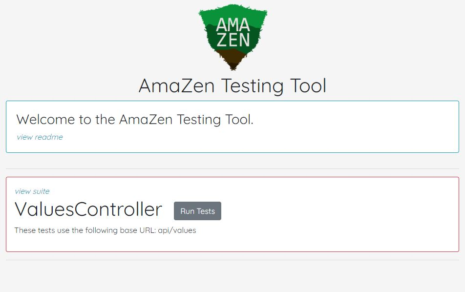

# AmaZen Testing Tool



Easily create and register TestSuites for testing WebApi's


```javascript

import { Test, Suite, TestReport } from "../Test.js"
import { api } from "../utils.js"

const PATH = "values"

export class ValuesSuite extends Suite {
  constructor() {
    super("ValuesController", "This is a test Controller", PATH)
    this.addTests(
      new Test(
        "Can Get values",
        PATH,
        async () => {
          let res = await this.get()
          this.values = res.data
          return new TestReport(true, "Able to get values")
        },
        'GET request. This should get a list of strings.',
        "string[]"
      ),
      new Test(
        'Can Create values',
        PATH,
        () => {
          throw new Error("Whoops something failed")
        },
        'string',
        'POST request. This should create a new value in your database. Your backend should attach a userId.',
        'value object { id, name, description }',
      )
    )
  }
}
```

The TestSuites can run all tests at once and individually. All TestExecution is handled with `try catch` blocks so you don't need to worry about describing failures explicitly. Custom Errors can be thrown and displayed.


## Legal Overview

The content under the CodeWorks®, LLC Organization and all of the individual repos are soley intended for use by CodeWorks Instruction to deliver Educational content to CodeWorks Students.

---

## Copyright

© CodeWorks® LLC, 2021. Unauthorized use and/or duplication of this material without express and written permission from CodeWorks, LLC is strictly prohibited.


